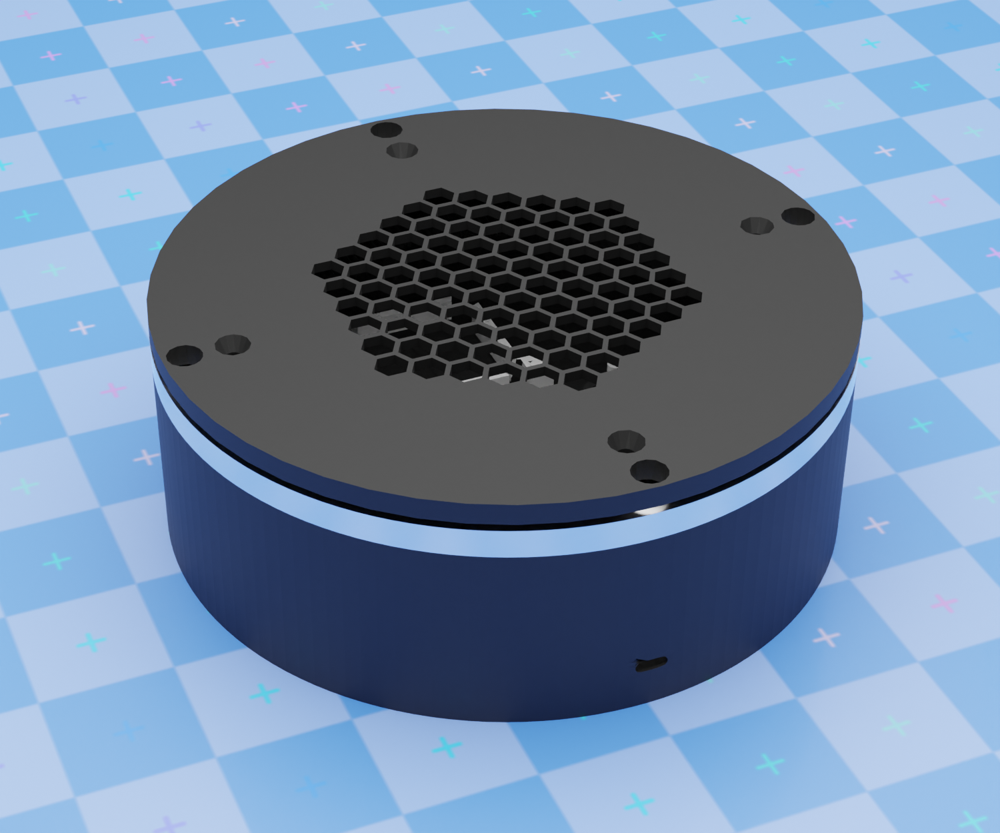

# Manège 🎠
## A Simple 360° Photo Turntable for Documenting Your Work



I built this for my wife, who makes willow baskets. She needed a way to document everything she creates - to showcase her work to potential clients, remember past pieces, and build up a portfolio over time. Turns out photographing dozens of baskets gets tedious fast, so I made this automated turntable that uploads photos directly to her website.

It ain't much, but it's honest work. Maybe it'll be useful for your workshop too.

---

## What It Does

- Rotates objects on a turntable and takes photos automatically
- Uploads pictures to WordPress as you shoot (so your website stays updated)
- Has a simple web interface you can use from your phone
- Powers everything through a single Ethernet cable (PoE)
- Includes LED lighting control if you need consistent lighting

It's basically a lazy susan with a stepper motor, a Raspberry Pi with cameras, and some code to tie it together.

---

## Why I Built It This Way

### The Story
When you make things by hand - baskets, pottery, woodwork, whatever - you end up with a lot of items that need photographing. Setting up each shot, rotating the object, taking multiple angles... it's repetitive and takes time away from actual making.

My wife needed:
- A record of everything she's made (memory fades, photos don't)
- Images to show potential clients ("I can make something like this one")
- A way to keep her website gallery updated without the hassle

### The Solution
Instead of a fancy commercial product photography rig, I went with parts you can actually get:
- **Raspberry Pi 5** - Does the heavy lifting (cameras, web server, uploads)
- **ESP32** - Controls the turntable motor
- **PoE HAT** - Powers everything through the Ethernet cable (one less wire to worry about)
- **Lazy susan bearing** - The turntable base (8 inches, supports decent-sized objects)
- **Stepper motor** - Smooth, precise rotation

It's all open source hardware and software. Build it yourself, modify it, whatever works for you.

---

## What You Get

### Camera System
- Two Raspberry Pi cameras (one for preview, one for high-res shots)
- Manual controls for focus, exposure, white balance
- Live preview so you can see what you're shooting
- 360° sequences with however many photos you want

### Turntable
- 8-inch diameter (handles most hand-made objects)
- Precise rotation steps (can go as fine as 0.005625° per step)
- Controlled over WiFi from the web interface

### Web Interface
- Works on phones, tablets, computers - anything with a browser
- Simple controls: rotate, capture, adjust settings
- Live camera preview
- No app to install

### WordPress Integration
- Photos upload automatically to your WordPress site
- Builds a gallery as you shoot
- Tag and organize as you go

### LED Control
- If you add LED strips for lighting, the system can control them
- Brightness adjustment via PWM
- All powered from the same PoE supply

---

## What You Need to Build One

### Core Parts
- Raspberry Pi 5 (8GB or 16GB)
- Raspberry Pi Camera Module 3
- Raspberry Pi HQ Camera
- PoE+ HAT for Raspberry Pi 5
- ESP32 dev board
- NEMA 17 stepper motor
- DRV8825 stepper driver
- 8-inch lazy susan bearing
- Power components (buck converters, etc.)

### Optional Additions
- LED light strips (12V COB strips work well)
- Enclosure (3D printable files included)
- MOSFET for LED control

**Full parts list with links: [BOM.md](BOM.md)**

The total cost is reasonable for what you get - cheaper than commercial photo turntables with fewer features.

---

## Getting Started

### Build the Hardware
Follow [ASSEMBLY_ORDER.md](ASSEMBLY_ORDER.md) for step-by-step instructions. The electrical wiring guide is in `hardware/electrical/wiring-guide.md`.

### Set Up the Software
```bash
cd manege
cp config.example.py config.py
nano config.py  # Add your WiFi and WordPress details
pip3 install -r requirements.txt
```

### Flash the ESP32
The turntable controller firmware is in `firmware/esp32_turntable/`. Upload it with Arduino IDE or PlatformIO.

### Start It Up
```bash
./scripts/start_webapp.sh
```

Then open `http://<raspberry-pi-ip>:5000` in your browser.

---

## How It Works

1. **Power On**: Plug in one PoE Ethernet cable. That's it - the Pi, cameras, LEDs, and turntable all power up.
2. **Take Photos**: Use the web interface to position your object, adjust camera settings, and capture.
3. **Auto-Upload**: Photos go straight to your WordPress media library and gallery.
4. **Keep Going**: Document your next piece. The system's ready whenever you are.

It's designed to be something you can use daily without thinking about it.

---

## Real Use Case: Willow Baskets

My wife makes traditional willow baskets. Each one is unique - different sizes, shapes, weaving patterns. Over a year, that's 50-100+ baskets.

Before Manège:
- Set up phone or camera on a tripod
- Manually rotate basket
- Take 8-12 photos per basket
- Transfer photos to computer
- Resize, rename, upload to website
- Repeat for next basket

With Manège:
- Place basket on turntable
- Press "Capture 360°"
- Watch it rotate and shoot automatically
- Photos appear in website gallery
- Done

The time savings add up fast. More importantly, she actually uses it - which means her website stays updated and potential clients can see what she's capable of making.

---

## Can You Use This?

If you make physical things and need photos of them, probably yes:
- Pottery, ceramics
- Woodworking, furniture
- Metalwork, jewelry
- Leather goods
- Textiles, baskets
- Scale models, miniatures
- Product prototypes

If you're just getting started and don't have many items yet, you might not need the automation. But if you're making dozens or hundreds of pieces a year, this saves real time.

---

## Documentation

- [Bill of Materials](BOM.md) - Parts list with supplier links
- [Assembly Guide](ASSEMBLY_ORDER.md) - How to build it
- [Wiring Guide](hardware/electrical/wiring-guide.md) - Electrical connections
- [Camera Setup](app/CAMERA_SETUP.md) - Configuring the Raspberry Pi cameras
- [Git Guide](GIT_QUICK_GUIDE.md) - How to contribute

---

## Contributing

This is an open project. If you build one and make improvements, share them:
- Better enclosure designs
- Code improvements
- Documentation fixes
- Ideas for features

[GitHub Issues](https://github.com/fitaine/manege/issues) is the place for bug reports and feature requests.

---

## License

- **Software**: MIT License - Use it however you want
- **Hardware**: CERN-OHL-P-2.0 - Open source hardware

Build it, sell products photographed with it, modify it for your needs. That's what open source is for.

---

## Credits

This project started with [twirly](https://github.com/veebch/twirly) by veebch - an elegant ESP32-based turntable. I added the Raspberry Pi cameras, PoE power system, LED control, WordPress integration, and web interface to make it work for documenting craft work at scale.

Thanks to veebch for the foundation and for open-sourcing their design.

---

## Support

Built in the Jura mountains of France, one piece at a time.

- **Website**: [tiphainebuccino.com](https://tiphainebuccino.com)
- **Issues**: [GitHub Issues](https://github.com/fitaine/manege/issues)

---

*Made for makers who'd rather spend time making things than photographing them.*
